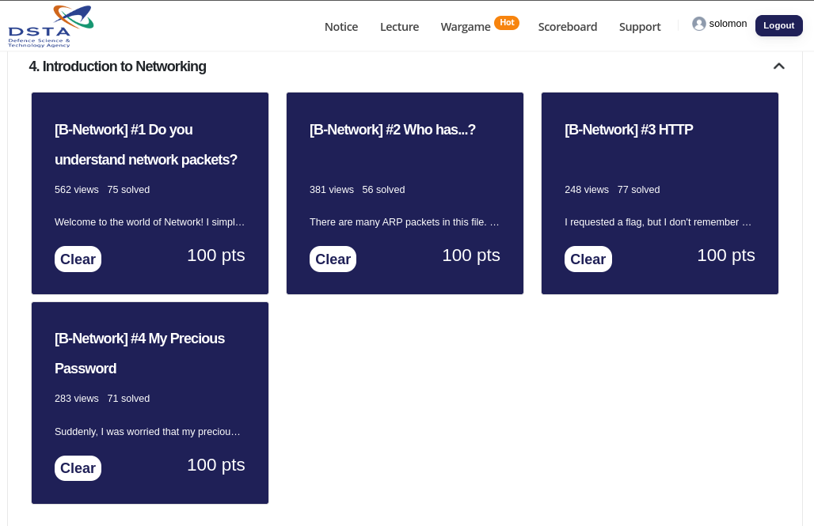
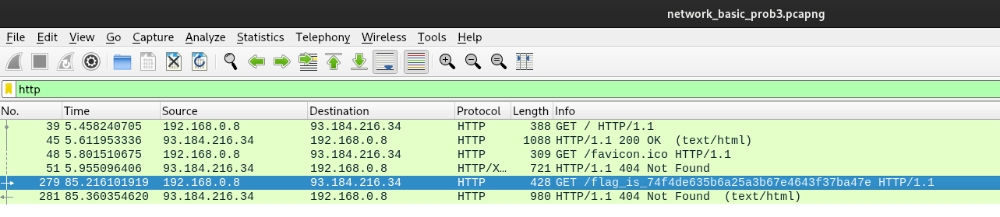
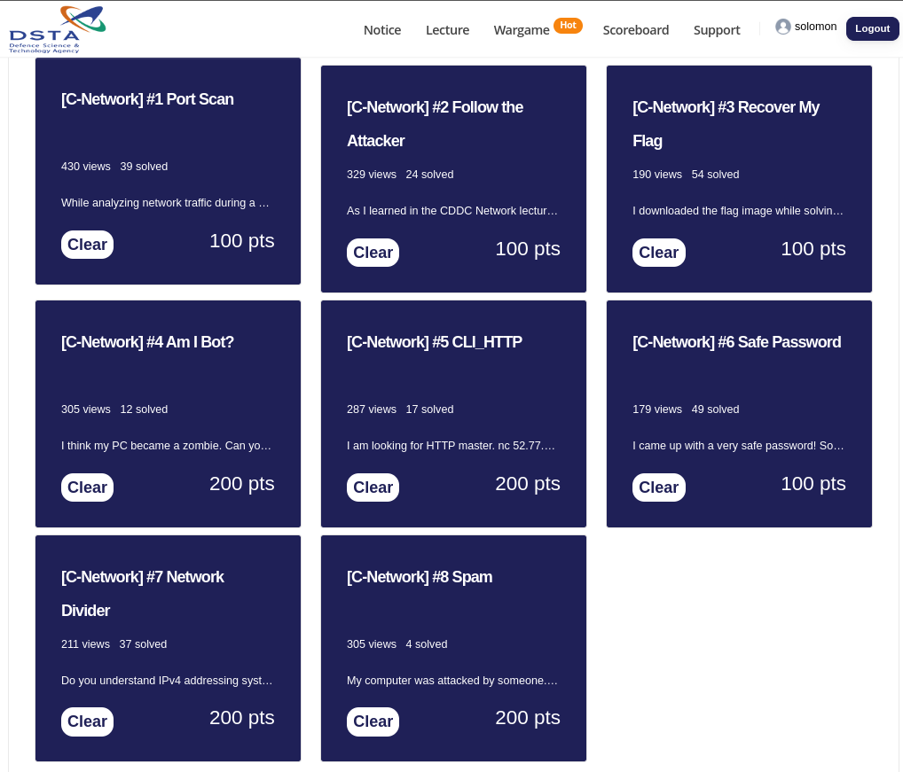
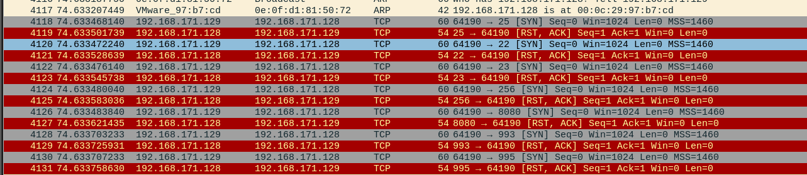
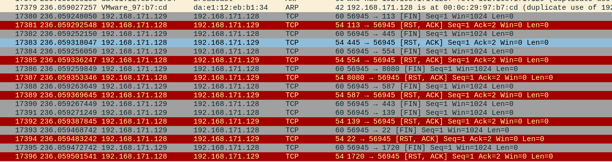
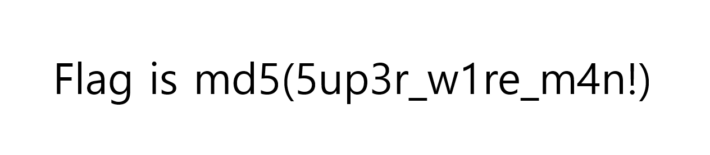
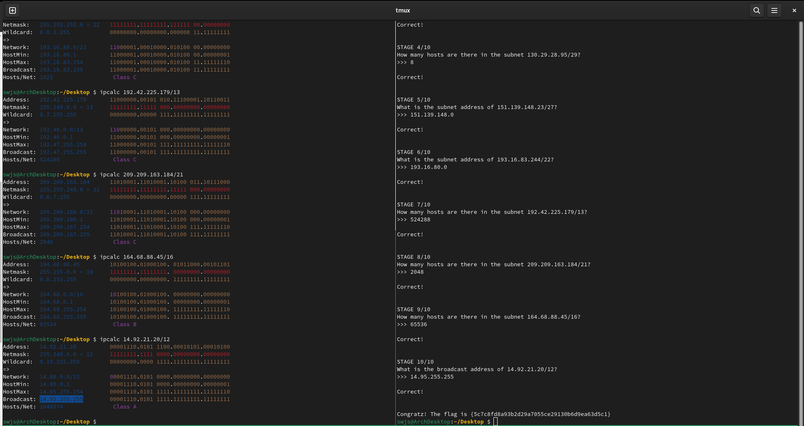
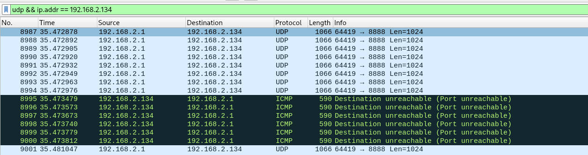

# CDDC 2022 Network Challenges

## Network Tutorials

This subsection contains the writeup of all the challenges in the Network category of the CDDC training website. All these challenges are pretty much the same. They look intimidating and can be very distracting. Knowing how to filter packets using Wiresharks, and a good computer networking knowledge is required to be able to solve these questions. This is the first time after many years of playing CTFs that I actually manage to finish all the Network questions.

### B-Network



#### B-Network #1 Do you understand network packets?

> 1. Find the IP address of the destination performing the 3-way handshake.
> 2. Find the "MAC address" of the destination gateway.


Once in Wireshark, the PCAP file shows alot of packets. We know a 3-way handshake comes from TCP, a connection-oriented protocol. Thus, we can search "tcp" in the filter bar. The first packet shown, packet number 6, is the one of interest. 

Clicking on it, and expanding the `Ethernet II` tab, we can see the Destination and Source hardware addresses. The Destination hardware address, aka MAC address, is `00:50:56:fa:1b:4c`. The flag is `md5(00:50:56:FA:1B:4C)`.

#### B-network #2 Who has...?

> Find the third ARP response packet received by the broadcasting host. Obtain the IP and MAC resolution.

Enter "arp" into the filter bar of Wireshark so we can get rid of all the other irrelevant network packets. Under the column labeled "Destination" you can see that those with "Broadcast" are ARP requests and the others are ARP responses.

We can filter out the ARP requests by entering `arp && eth.dst != ff:ff:ff:ff:ff:ff` into the filter bar. The third response packet (packet number 1071) shows that the IP address `192.168.171.1` is at MAC address `00:0c:29:97:b7:cd`. The flag is `md5(192.168.171.1_00:0C:29:97:B7:CD)`. 

#### B-Network #3 HTTP

> I requested a flag, but I don't remember which website it was. Can you find it?

The biggest clues for this challenge are "HTTP", "requested", and "website". It means the flag is related to a HTTP request. Enter "http" into the filter bar of Wireshark so only HTTP packets are shown.



The request made is:
```
GET /flag_is_74f4de635b6a25a3b67e4643f37ba47e HTTP/1.1
Host: example.com
User-Agent: Mozilla/5.0 (X11; Linux x86_64; rv:78.0) Gecko/20100101 Firefox/78.0
Accept: text/html,application/xhtml+xml,application/xml;q=0.9,image/webp,*/*;q=0.8
Accept-Language: en-US,en;q=0.5
Accept-Encoding: gzip, deflate
Connection: keep-alive
Upgrade-Insecure-Requests: 1
```

The flag is `74f4de635b6a25a3b67e4643f37ba47e`.

#### B-Network #4 My Precious Password

> Suddenly, I was worried that my precious password might be exposed to others. Is my password safe?

Opening the file in Wireshark, we see packets of two different protocols - TCP and TELNET. TELNET is notoriously unsafe because everything is in plaintext. Having done some CTFs before, and knowing TCP does not involve passwords in anyway, I instantly knew that the password is definitely from TELNET.

So, right-clicking on one of the TELNET packets (any one will do), then selecting `Follow > TCP Stream`, we can see that the login attempts. For example, in TCP stream 0, you would see:
```
........... ..!.."..'.....#..... ..#..'........!.."..... .....#.....'.............P...... .38400,38400....#.ubuntu:0....'..DISPLAY.ubuntu:0......xterm-256color..............Kali GNU/Linux Rolling
kali login: aaddmmiinn
.
Password: v3rys3cret
.

Login incorrect
kali login: aaddmmiinn
.
Password: v3rysecret
.

Login incorrect
kali login: 
.
Password: ...
```

But v3rysecret is not the password since the login is incorrect. On the bottom right hand corner of the popup, above the `Close` button, you can see the `Stream` beside a box with a number in it. Click the arrows to vary the TCP stream. As you vary it, you will see different TELNET streams appear. For example, TCP stream 1 shows:

```
........... ..!.."..'.....#..... ..#..'........!.."..... .....#.....'.............P...... .38400,38400....#.ubuntu:0....'..DISPLAY.ubuntu:0......xterm-256color...........Kali GNU/Linux Rolling
...kali login: rroooott
.
Password: simple password
.

Login incorrect
kali login: rroooott
.
Password: simplepassw0rd
.

Login incorrect
kali login: ssccss...^C
```

TCP stream 2 is what we want. It shows a successful login (well at least there was no incorrect-login error. The flag is `md5(helloking)`.

```
........... ..!.."..'.....#..... ..#..'........!.."..... .....#.....'.............P...... .38400,38400....#.ubuntu:0....'..DISPLAY.ubuntu:0......xterm-256color..............Kali GNU/Linux Rolling
kali login: kkiinngg
.
Password: helloking
.
...^C
```

### C-Network



#### C-Network #1 Port Scan

> While analyzing network traffic during a CDDC lecture, someone was found to be performing a port scan. The person changed the MAC address and again performed port scanning. Find the MAC address of the attacker. (There are two MAC addresses in total)

A port scan, simply put, is just sending a packet (of one of many possible types) to obtain a response from the target server to determine what service is running on it. If you want to know more, Google what Nmap is.

In the given pcap, we can see two types of scans: a SYN port scan, and a FIN port scan.

A SYN packet is clearly marked with "[SYN]". Notice how it is sent to multiple different destination ports: 25, 22, 23, 256, 8080 etc. Those are the ports being scanned.



Open up the `Ethernet II` tab in Wireshark, and you can see the Source MAC address. It is `0e:0f:d1:81:50:72`. That is the first part of the flag.

`ip.addr == 192.168.171.129 && eth.addr != da:e1:12:eb:b1:34` shows you the SYN port scan process.

A FIN packet is clearly marked with "[FIN]". Notice how it is sent to multiple different destination ports, just like the SYN packets were in the SYN scan. Don't worry about the destination port numbers not being the same. 



Open up the `Ethernet II` tab in Wireshark, and you can see the Source MAC address. It is `da:e1:12:eb:b1:34`. That is the second part of the flag.

`ip.addr == 192.168.171.129 && eth.addr == da:e1:12:eb:b1:34` shows the FIN port scan process.

The flag is `md5(0E:0F:D1:81:50:72_DA:E1:12:EB:B1:34)`.

#### C-Network #2 Follow the Attacker

> As I learned in the CDDC Network lecture, I discovered that the ARP cache has been poisoned! The following is the ARP Table at the time and the packets captured immediately after discovery. Can you figure out what tampered HTTP response the attacker is making?

ARP poisoning can be observed when two or more IP addresses are mapped to the same MAC address. The attack is a Man-In-The-Middle (MITM) attack when it pretends to be the server (from the perspective of the client) and the client (from the perspective of the server). Being the middle man, the attacker can modify contents sent from the server to the client by intercepting it, modifying it, then forwarding it to the client. 

When we type "arp" into the filter bar to see just the ARP traffic, we can see that both IP addresses `192.168.171.2` and `192.168.171.128` are mapped to the same MAC address, `b6:1c:d7:4a:4c:cc`.

There are many packets in this pcap. Obviously, we aren't going to look through those one by one. The challenge description, "tampered HTTP", helps us narrow the search. "Tampered" means that the packet must originate from `b6:1c:d7:4a:4c:cc`, the attacker's machine. So, lets enter "http && eth.src == b6:1c:d7:4a:4c:cc" to list out tampered HTTP packets. The filtered results lists two HTTP packets, packets number 4018 and 4048.

Right-click on either packet, and click `Follow > HTTP Stream`. The flag is `64b37efebb111b187a6738b12d1aab44`.
```
...
The World Wide Web is about communication between web clients and web servers.

Clients are often browsers (Chrome, Edge, Safari), but they can be any type of program or device.

Servers are most often computers in the cloud.

ref : https://www.w3schools.com/whatis/whatis_http.asp
		</pre>
		<h3>The Flag is {64b37efebb111b187a6738b12d1aab44}</h3>
	<body>
</html>
GET /favicon.ico HTTP/1.1
...
```

#### C-Network #3 Recover My Flag

> I downloaded the flag image while solving the CTF problem, but I don't remember where I saved it. Fortunately, I was capturing the packet, so I think you can recover it. Can you recover the image?

Scrolling through the pcap packets, I notice HTTP appeared quite a little. I ignored the other protocols like TLS and QUIC since they are encrypted. To filter out all the other non-HTTP traffic, enter "http" into the filter bar in Wireshark.

Notice that there is one GET request packet to `/network-flag.png`. It is packet number 630. Right-click on it, and select `Follow > HTTP Stream`.

To export the PNG, close the popup showing the HTTP stream, select the HTTP OK packet, packet number 633. You will see a "Portable Network Graphics" tab. Click on it once, go to `File > Export Packet Bytes` and save it with a filename of your choice with the `.png` extension. Open up the file, and you'll get your flag.




#### C-Network #4 Am I Bot?

A computer or IoT device taken over as a bot usually reports to a Command and Control (C2) center. We want to find out how it communicates with the C2 server. Since the majority of the pcap is the QUIC protocol, we can remove it by entering "!quic" in the filter bar in Wireshark. This reveals alot of HTTP, TCP and TLS traffic. We can safely ignore the TLS traffic since it, like QUIC, is encrypted traffic.

While I have no evidence that HTTP is the communication method with the C2 server, I was intrigued enough to look at the request packets. Typing "http" into the filter bar shows HTTP packets. Some of the HTTP requests made were obvious signs of a C2 server.
```
GET //aes/newkey HTTP/1.1
GET //command HTTP/1.1
``` 
This is the full request and response for `aes/newkey`:
```
GET //aes/newkey HTTP/1.1
Host: 203.249.22.199:2012
User-Agent: python-requests/2.22.0
Accept-Encoding: gzip, deflate
Accept: */*
Connection: keep-alive

HTTP/1.0 200 OK
Content-Type: text/html; charset=utf-8
Content-Length: 71
Server: Werkzeug/2.0.3 Python/3.6.5
Date: Tue, 19 Apr 2022 20:27:16 GMT

{"key": "c0mm4nd_4nd_ctr1", "iv": "0xCDDC202200000000d761bd823c9d792c"}
```

This is the full request and response for `//flag`. Obviously, this is where our flag is. But `//aes/newkey` is an obvious sign that it is AES encrypted.

```
GET //flag HTTP/1.1
Host: 203.249.22.199:2012
User-Agent: python-requests/2.22.0
Accept-Encoding: gzip, deflate
Accept: */*
Connection: keep-alive

HTTP/1.0 200 OK
Content-Type: text/html; charset=utf-8
Content-Length: 96
Server: Werkzeug/2.0.3 Python/3.6.5
Date: Tue, 19 Apr 2022 20:27:16 GMT

4ecd2e7378c20d1d8213c20ccd627b74f1ccb3a0bb8c498c351536ef1118280262c6c7a1dc303c194fe3e925de7a5bb5
```

The AES parameters are:
- Key: `c0mm4nd_4nd_ctr1`
- IV: `0xCDDC202200000000d761bd823c9d792c` 

Using the `AES Decrypt` tool in [Cyberchef](https://gchq.github.io/CyberChef/), you get `Flag is 1dccadfed7bcbb036c56a4afb97e906f`.

The flag is `1dccadfed7bcbb036c56a4afb97e906f`.

#### C-Network #5 CLI\_HTTP

I am not so sure how this is a Network problem. This seems more like a Web challenge.

The solution for stage 0 is:
```
GET / HTTP/1.1
END
```

The solution for stage 1 is:
```
PATCH /cbde274c07a029d6 HTTP/1.1
END
```

The solution for stage 2 is:
```
OPTION /01ac7c447839b59e HTTP/1.1
Cookie: stage2=good
END
```

The solution for stage 3 is:
```
POST /b4dabb3da79237af HTTP/1.1
Content-Type: application/x-www-form-urlencoded
Content-Length: 11

stage3=nice
END
```
Take note that a newline is required after the `Content-Length` header.

The solution for stage 4 is:
```
VIEW /bd1e4472b9eb43bb?stage4=cool HTTP/1.1     
END
```

The solution for stage 5 is:
```
LZFJOAWEFN /flag?stage=flag&flag=gimme HTTP/1.1
Cookie: my_cookie=awesome; flag=gimme
Content-Type: application/x-www-form-urlencoded
Content-Length: 19

id=admin&flag=gimme
END
```

And then the flag is given.

#### C-Network #6 Safe Password

> I came up with a very safe password! So I set this password on my account!

Looking through the pcap file, we see TELNET again. It's a pretty big clue that that is where the password will be.


Just right-click on any TELNET packet, then select `Follow > TCP Stream`. The first stream, `tcp.stream eq 0` gives us the flag.

```
..%........... ..!.."..'...login: aaddmmiinn

password: my_super_safety_password_and_flag_c551e73bd6b9a52f6afd3e60b09469c8f31a9d21

Login success!
..
```


#### C-Network #7 Network Divider

This would be a challenge to solve manually. Having taken a computer network class, I know the pain of manually calculating the network addresses. So, I just use `ipcalc` instead.

Also take note that this challenge takes the network address and broadcast address as valid host addresses. For example, a `/24` network would typically have 65534 hosts, but this challenge expects 65536.



#### C-Network #8 Spam

This challenge was really interesting, even though the flag was pretty dumb.

The file we are given is HUGE! It's a whopping 207MB. That may seem intimidating at first, but with the help of filtering, we can easily find the packet(s) of interest. Opening the pcap, we can see

1. Alot of TCP packets to and from IP address `91.189.91.38`
2. Alot of UDP packets to `192.168.2.134`.
3. Alot of TCP packets to and from IP address `91.189.91.38`

`91.189.91.38` belongs to Canonical, which manages the Ubuntu linux flavor. If you select one of the TCP packets, you might see a request like this (alternative, type "tcp.stream eq 8" into the filter bar):
```
GET /ubuntu/pool/main/l/linux-firmware/linux-firmware_1.187.30_all.deb HTTP/1.1
Host: us.archive.ubuntu.com
User-Agent: Debian APT-HTTP/1.3 (2.0.6)

HTTP/1.1 200 OK
Date: Fri, 29 Apr 2022 05:42:21 GMT
Server: Apache/2.4.29 (Ubuntu)
Last-Modified: Wed, 20 Apr 2022 08:39:11 GMT
ETag: "76ee294-5dd11ed6c1c7a"
Accept-Ranges: bytes
Content-Length: 124707476
Cache-Control: max-age=86400
Content-Type: application/x-debian-package
```

Such requests are made when the Ubuntu system is being updated, so there is nothing suspicious here. We can safely ignore those with "!tcp" in the filter bar.

Notice however, that the UDP packets, upon deeper inspection, all send the same data within milliseconds of eachother, to `192.168.2.134`. So much so that the destination cannot take it anymore and replies with a ICMP Port-Unreachable error packet. This is a clear sign of UDP flooding.



This is where the challenge gets dry and guessy (just like 96888 \#iykyk). Here are some logical, but unaccepted solutions:

> 192.168.2.1\_denialofserviceattack
> 192.168.2.1\_denialofservice
> 192.168.2.1\_udpfloodattack
> 192.168.2.1\_udpflood
> 192.168.2.1\_flood
> 192.168.2.1\_udpdos
> 192.168.2.1\_dos

The flag that is actually wanted is `sha1(192.168.2.1_udpflooding)`. Yeah, I know how it feels.

## Network Challenges

Unfortunately, the organizers of the CTF took down the challenge website immediately after the CTF ended. As my team and I were busy solving challenges, we spared little time to document how we solved them. So, I am not able to provide writeups of the challenges.
